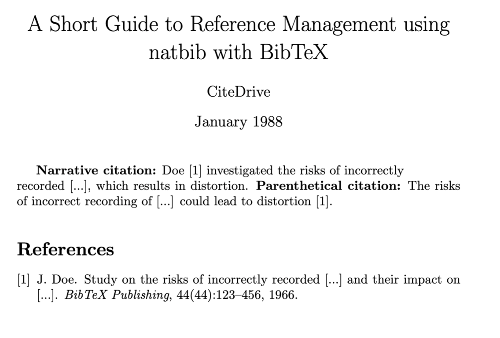

# A Short Guide to Reference Management using natbib with BibTeX

The natbib package adds new features to the standard `\cite{*}` command in LaTeX that includes in-text citations with various options and customizations, especially for author-year schemes and displaying the textual and parenthetical when using BibTeX.

:::tip
It is worth noting that the package is compatible with both author-year and numerical citations and with the standard bibliography `*.bst` files.
:::

This article explains how to use natbib to format and cite bibliographic sources.

## Getting started: Using Parenthetical and Textual/Narrative In-Text Citations with natbib
We specify a minimal structure, similar to the one discussed in the previous section. To do this, we load the library with `\usepackage{natbib}`. The library provides options that can be passed via `\usepackagee[options]{{natbib}`, which we cover later. The basic citation commands in Natbib are `\citet{*}` for textual/narrative citations and `\citep{*}` for parenthetical citations.


```latex
\documentclass{article}
\usepackage{natbib}
\bibliographystyle{apalike}
\title{A Short Guide to Reference Management using natbib with BibTeX}
\author{CiteDrive}
\date {January 1988}

\begin{document}

\maketitle
\textbf{Narrative citation:} \citet{Doe:1966} investigated the risks of incorrectly \\
recorded [...], which results in distortion.
\textbf{Parenthetical citation:} The risks of incorrect recording of [...] could lead to distortion
\citep{Doe:1966}.

\medskip

\bibliography{sample}

\end{document}

```
With \bibliography{sample} we refer to our .bib-file, which contains two sample entries:

```latex
@article{Doe:1966,
  author =       "John Doe",
  title =        "Study on the risks of incorrectly recorded [...] and their impact on [...].",
  journal =      "BibTeX Publishing",
  volume =       "44",
  number =       "44",
  pages =        "123--456",
  year =         "1966",
}


@article{smith201X,
	title        = {An interesting article},
	author       = {John Smith},
	year         = {201X},
	journal      = {Journal of Interesting Articles}
}
```


An example that natbib works wonderfully with numeric citation styles; let's change the corresponding commands of the code above:
```latex
\usepackage[square,numbers]{natbib}
\bibliographystyle{abbrvnat}
```



## `cite{*}` commands provided by natbib

The following table summarizes the differences between the commands, based on `cite{*}`, and what you might expect to see. Both numeric and author-year styles are included, as well as multiple citations.

:::caution
As we subsequently discover, we should note that some examples are not chosen sensibly: Hardly ever will two different sources share one chapter. `\citet*{...}` lists all authors without et. al.   Nevertheless, the table should offer a solid understanding of how the commands behave.
:::

| Command (single citation) | Output (author-year) | Output (Numeric) | Command (Multiple citations) | Output (author-year) | Output (Numeric) |
|---------------------------|----------------------|------------------|------------------------------|---|---|
|`\citet{Doe:1966}`|Doe (1966) |Doe [1]|`\citet{Doe:1966,smith201X}`|Doe (1966); Smith (201X)|Doe [1], Smith [2]|
|`\citet[chap.~4]{Doe:1966}`|Doe (1966, chap. 4)|Doe [1, chap. 4]|`\citet[chap.~4]{Doe:1966,smith201X}`|Doe (1966); Smith (201X, chap. 4)|Doe [1], Smith [2, chap. 4]|
|`\citep{Doe:1966}`|(Doe, 1966)|[1]|`\citep{Doe:1966,smith201X}`|(Doe, 1966; Smith, 201X)|[1, 2|
|`\citep[chap.~4]{Doe:1966}`|(Doe, 1966, chap. 4)|[1, chap. 4|`\citep[chap.~4]{Doe:1966,smith201X}`|(Doe, 1966; Smith, 201X, chap. 4)|1, 2, chap. 4]|
|`\citep[see][]{Doe:1966}`|(see Doe, 1966)|[see 1]|`\citep[see][]{Doe:1966,smith201X}`|(see Doe, 1966; Smith, 201X)|[see 1, 2]|
|`\citep[see][chap.~4]{Doe:1966}`|(see Doe, 1966, chap. 4)|[see 1, chap. 4]|`\citep[see][chap.~4]{Doe:1966,smith201X}`|(see Doe, 1966; Smith, 201X, chap. 4)|[see 1, 2, chap. 4]|
|`\citet*{Doe:1966}`|Doe (1966)|Doe [1]|`\citet*{Doe:1966,smith201X}`|Doe (1966); Smith (201X)|Doe [1], Smith [2]|
|`\citep*{Doe:1966}`|(Doe, 1966)|[1]|`\citep*{Doe:1966,smith201X}`|(Doe, 1966; Smith, 201X)|[1, 2]|


Further commands and options around "cite" can be found in the *Reference sheet for natbib usage* [PDF]: https://gking.harvard.edu/files/natnotes2.pdf  

## Options for `natbib`
